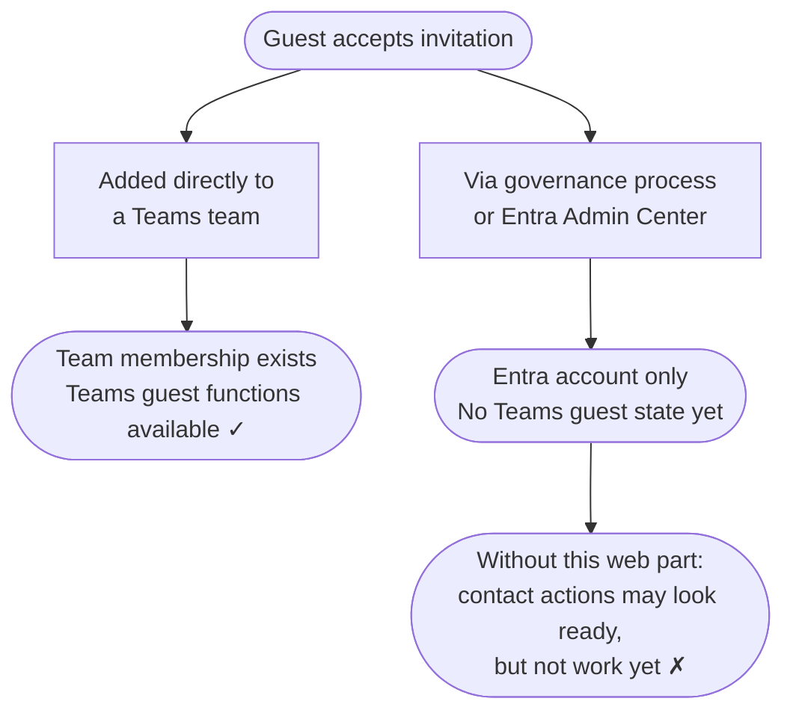

## The Hidden Gap {#the-gap}

A guest clicks "Accept" on your Microsoft 365 invitation. A Microsoft Entra
guest user object is created in your tenant.

What is *not* guaranteed: a clear next step or support contact.

The sponsor relationship may already exist in Entra, but it remains invisible
to the guest. There is no built-in SharePoint experience that shows them who
their sponsors are, let alone how to contact them.

Whether Microsoft Teams works for this guest depends on one central fact: has this guest
already been added to at least one Teams team in your tenant, or not?

That creates a communication gap: the organisation may already know who is
responsible for the guest, but the guest cannot see any of it.

## Why Landing Pages Matter {#entrance-page}

In many governance-driven invitation flows, the redirect after invitation
redemption never becomes a deliberate guest journey. If the workflow doesn't
point the guest somewhere better, one common landing point is My Apps
— a portal built for application discovery and launch, not for explaining who
is responsible for the guest or what to do next.

Technically, a tenant-scoped Microsoft Teams deep link is not hard to generate. Microsoft Graph API
invitation flows can set a custom redirect URL, and governance tools often can
too. But a Teams link only helps once Teams guest functionality is actually
available for that account. If no team membership exists yet, the guest may
accept the invitation successfully while Teams guest functionality is still
unavailable.

That is why a SharePoint guest landing page is pragmatic. It is a stable,
controllable first destination that can work before Teams onboarding is
finished. Out of the box, SharePoint can only show static guidance and generic
links. It cannot surface the guest's actual sponsors.

## Sponsor vs Inviter {#sponsor-vs-inviter}

In many Microsoft Entra B2B guest onboarding flows, the inviter and the sponsor
are not the same record.

The inviter is whoever triggered the invitation email or workflow. The sponsor
is the person or group recorded in Microsoft Entra's Sponsors field for that
guest relationship. In standard Microsoft Entra invitation flows, the inviter becomes the
default sponsor unless someone else is specified; SharePoint sharing
invitations to brand-new external users are a documented exception. Guests
usually see the inviter first because that name appears in the mail trail. For
ongoing support, access questions, and onboarding context, the sponsor
information is usually the more relevant signal.

That difference matters on a SharePoint guest landing page. If the page only
repeats the inviter name, the sponsor relationship is still invisible.

[Read the full sponsor vs inviter explanation]({{ '/en/sponsor-vs-inviter/' | relative_url }}).

## Two Paths, Two Outcomes {#two-paths}

### Directly added to a Microsoft Teams team

An employee adds an external contact directly to a team, and Microsoft sends
the invitation behind the scenes. Once the guest accepts and that first team
membership is in place, Teams guest functionality becomes available in your
tenant.

**The guest is not just in Entra. They also have a real Teams entry point.**

### Via a governance process or the Microsoft Entra admin center

A lifecycle governance platform, a script, or an Entra admin workflow creates
the guest account formally. The account exists in Entra, but no Teams team has
been assigned yet.

**The guest exists in Entra. Teams guest functionality is not there yet.**

This state is invisible to the guest unless something surfaces it explicitly.

## What the Guest Sees {#what-the-guest-sees}

Without Guest Sponsor Info, a SharePoint landing page usually doesn't answer
the guest's actual questions:

| Question | Without this web part |
|---|---|
| Who are my sponsors? | Not visible to the guest |
| Who are my backup sponsors? | Not visible to the guest |
| How do I reach them? | Not visible to the guest |
| Is there manager context that helps me orient myself? | Not visible to the guest |
| Is Microsoft Teams already ready for contact? | Not visible to the guest |
| If a custom contact action exists | It may look ready even though Teams guest functionality is not ready yet |

> There is no built-in explanation telling the guest whether the action is
> unavailable, misconfigured, or simply not ready for their account yet.

With Guest Sponsor Info, that abstract relationship becomes a real, visible
contact surface for the guest:

  <figure class="screenshot-pair__item screenshot-pair__item--desktop">
    
    <figcaption class="screenshot-pair__caption">Desktop</figcaption>
  </figure>
  <figure class="screenshot-pair__item screenshot-pair__item--mobile">
    
    <figcaption class="screenshot-pair__caption">Mobile</figcaption>
  </figure>

## What the Web Part Does {#what-this-web-part-does}

**Guest Sponsor Info** sits on the SharePoint landing page guests reach after
accepting an invitation. It does three things:

1. **Shows sponsors** — the internal sponsor contacts assigned in Microsoft
  Entra for the guest relationship. That relationship already exists in Entra,
  but the guest could not previously see it for themselves. The web part turns
  it into names, faces, titles, and actual contact options on the landing page.
  No per-guest configuration. No manual updates when sponsors change.

2. **Shows backup sponsors and optional manager context** — the guest does not
   just see the one person who happened to invite them. They can also see
   replacement sponsors and selected manager information that makes the contact
   structure easier to understand.

3. **Detects Teams readiness** — if Teams guest access is not ready yet,
   the web part detects this and responds: chat and call buttons are disabled,
   and a clear status message explains the situation. The guest sees a face, a
   name, and an honest status — not an action that looks ready but is not.

A guest whose Teams access is still being provisioned can reach their sponsor
by email and knows that Teams is on its way. Even after Teams is working, the
web part still adds value: Teams guest access does not surface Entra sponsor
metadata on its own.

This page is deliberately about the guest-facing last mile. Guest Sponsor Info
can only show what an upstream process has already decided: who the sponsor
is, whether backup sponsors exist, and whether the guest is actually brought to
the landing page instead of My Apps. It does not replace the governance layer
behind invitations, redirects, sponsor ownership, and lifecycle changes. If
you need that upstream layer as well, you either build it yourself on top of
Microsoft Graph invitations and automation, or you use a product such as
EasyLife 365 Collaboration.

  

    
    

      Workoho, the team behind Guest Sponsor Info, is an EasyLife 365
      Platinum Partner.
    

    
    

      Book a demo with Workoho to see how EasyLife handles guest governance and lifecycle here.
    

    <a href="https://wkho.io/easylife365-demo?utm_source=guest-sponsor-info&amp;utm_medium=website&amp;utm_content=easylife-why-en"
      target="_blank" rel="noopener" class="easylife-cta">Book a Demo</a>
  

  

    
Ready to set it up?

    
The built-in Setup Wizard guides you through the rest.

  

  

    <a href="{{ '/en/setup/' | relative_url }}" class="btn btn-teal">Setup Guide</a>
    <a href="{{ '/en/features/' | relative_url }}" class="btn btn-outline">Explore Features</a>
  

